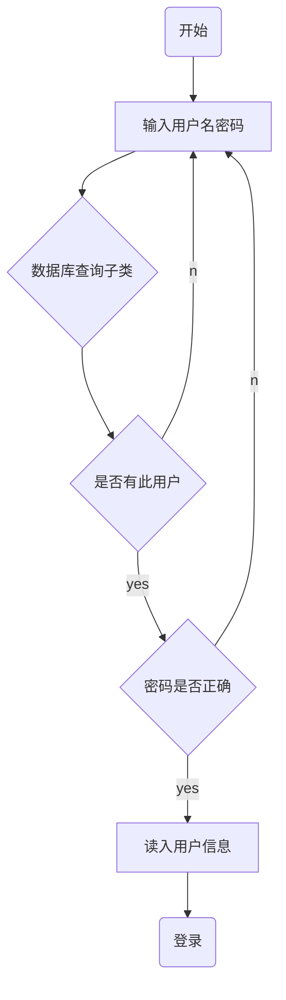

>当在多个电脑上协同工作时，我们不免用到版本控制系统，版本控制系统分为分布式与集中式。
>集中式版本控制系统的代码存放在中央仓库，用的时候需要先拉取并且一直保持联网才能使用，常见的有`CVS`与`SVN`。
>分布式版本控制系统的代码存放在中央仓库与每个人的电脑中，因此也比较安全，常见的有`git`。
>`git`是世界上最先进的版本控制系统，有强大的分支管理功能。

### git的安装和配置
#### 下载与安装
##### Windows
去git官网(https://git-scm.com/downloads)下载安装包安装
##### Ubuntu/Debian
```shell
$ apt-get install libcurl4-gnutls-dev libexpat1-dev gettext   libz-dev libssl-dev

$ apt-get install git

$ git --version
git version 1.8.1.2
```
##### Centos
```shell
$ yum install curl-devel expat-devel gettext-devel openssl-devel zlib-devel

$ yum -y install git-core

$ git --version
git version 1.7.1

```

#### 设置全局身份
右键打开Git Bash，设置用户名和邮箱
```shell
$ git config --global user.name "Jeafly"
$ git config --global user.email "jyf1647586191@163.com"
```
:::tip
如果用了 --global 选项，那么更改的配置文件就是位于你用户主目录下的那个，以后你所有的项目都会默认使用这里配置的用户信息。

如果要在某个特定的项目中使用其他名字或者电邮，只要去掉 --global 选项重新配置即可，新的设定保存在当前项目的 .git/config 文件里。
:::

:::tip
可以通过以下命令查看配置信息
```shell
$ git config --list
```
:::

#### 生成密钥
```shell
$ ssh-keygen -t rsa -C "邮箱名称"
```
:::tip
生成过程中有设置密码的环节，无需设置密码可直接回车
生成成功后私钥和公钥存在于用户目录的.ssh中。
:::

私钥存放在C:\Users\16475\.ssh\id_rsa.pub中，打开复制粘贴到对应git仓库的SSH Keys中即可。

### 使用git
#### git使用流程

:::tip
初始化仓库 -> 
:::

##### 初始化git仓库
```shell
$ git init
```

###### 




